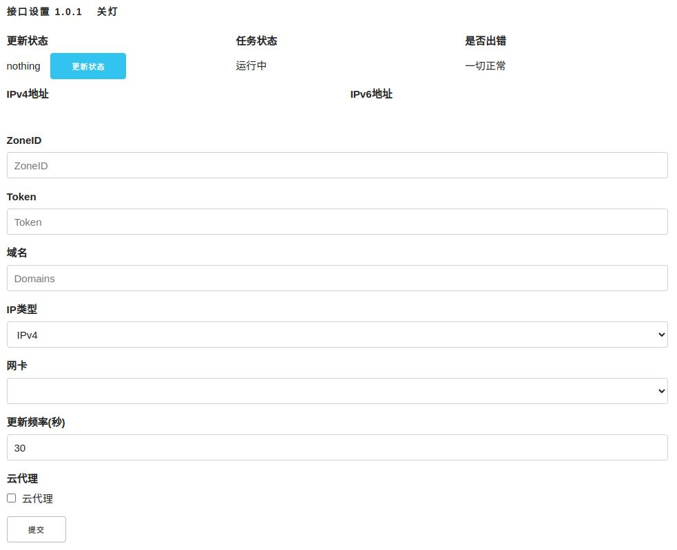
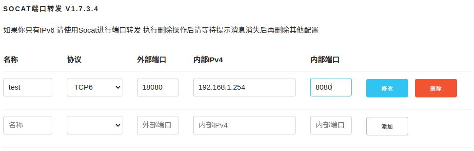
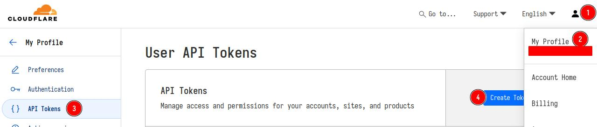
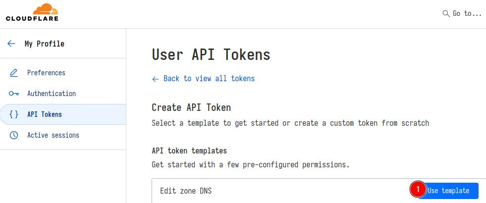
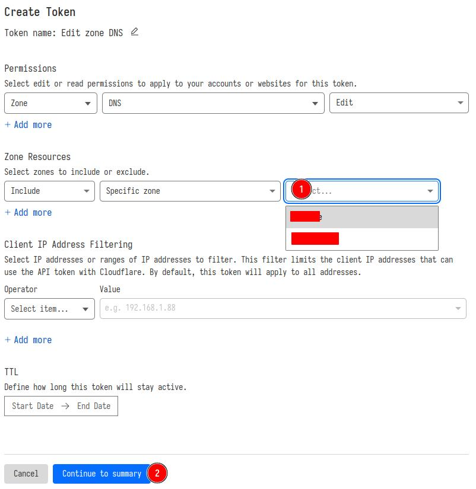
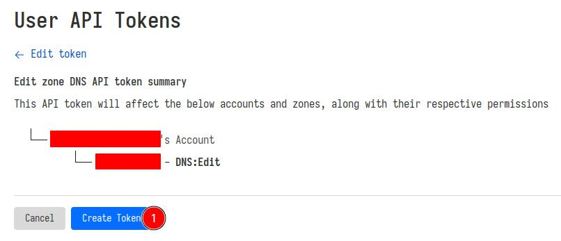
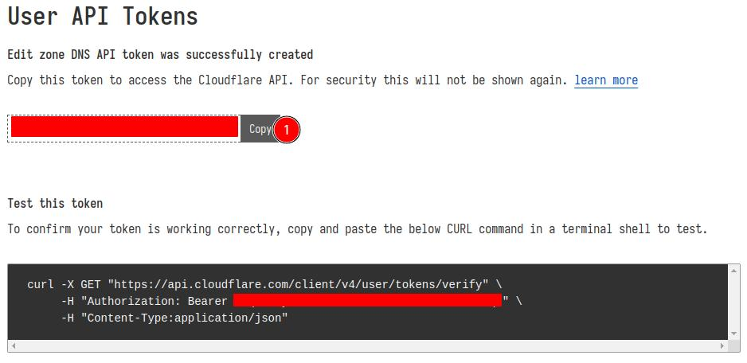
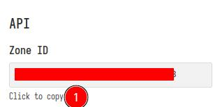

# Cloudflare DDNS Go
### 说明
使用[gin](https://github.com/gin-gonic/gin)编写的一个带简单管理界面的Cloudflare DDNS和socat端口转发的工具。
只支持linux系统
前端使用[轻量vue](https://github.com/vuejs/petite-vue)和[轻量css](https://github.com/dhg/Skeleton)编写

主程序3M大小 在op上占用内存18.67M 内存和存储空间紧张的请谨慎用

### 工作原理
- 通过ip addr命令获取所选定的网卡的ipv4或ipv6的ip地址，注意，这里获取的不一定是公网ip 只是从网卡信息里获取到的ip地址。
我使用openwrt 所以选择pppoe-wan 名称可能不同 根据实际情况选取
- 如果获取失败就使用[ipw.cn](https://ipw.cn)获取ip。
- 获取成功后会缓存ip到配置文件中，通过设置的 更新频率 的时间进行获取网卡ip，如果缓存的ip和网卡获取的ip不同 就访问cf的ddns接口并对比cf DNS设置的ip和获取到的ip是否相同，如果不同就更新ip到cf DNS. 
- 如果域名解析记录不存在，会自动创建。(前提，这个token拥有域名的编辑权限)

- - 因为ipv6会把局域网内的设备全部暴露在公网，担心安全问题，我在op的防火墙中禁止了所有ipv6的入站流量访问局域网设备
只让ipv6的入站流量可以访问op设备本身 所以需要socat进行端口转发
socat的作用是把ipv6的入站流量转发到局域网内的其他设备
- - 程序会自动检测是否安装了socat 如果没有安装会提示op系统的安装命令 其他linux请自行查找安装命令
- - 不担心局域网内设备ipv6暴露公网的话 就运行本程序到设备上并选择可以正确获取ipv6的网卡

### 使用说明
使用BasicAuth做了访问验证
默认用户名admin
密码 1234567890
可以通过管理页最下方进行密码修改

- 填入相应的ZoneID Token 域名
- IP类型根据实际情况选择 选项有 ipv4 ipv6 ipv4&ipv6
- - 如果没有ipv4公网ip 就选择ipv6即可
- - 如果有ipv4公网ip 同时有希望ipv6也可以访问 就选择 ipv4&ipv6
- 网卡选择可正确获取ipv6的网卡
- - 如果跑在op上 就选择 pppoe-wan(名称可能不同 根据实际情况选取)
- 更新平率默认30秒
- - 每隔30秒从网卡获取一次ip
- 云代理对应cf DNS解析后面的porxy(小云朵)
- - 如果只有ipv6 又想要ipv4也可以访问的话 更不介意cf的国内访问超级降速 可以打开这一项
- 都填写好后 一定要记得点提交

### socat端口转发说明

- 在列表最下方的空行 填入相应的参数 添加新的端口转发规则
- 名称只支持英文 数字 和下划线_ 中文和特殊字符会被自动过滤掉
- 协议 TCP6 UDP6 如果某端口同时需要TCP和UDP 请添加两次
- 外部端口 从外网访问的端口
- 内部ipv4 需要被访问的局域网内的设备 IP要手动填写
- 内部端口 需要被访问的局域网内的设备的服务所监听的端口
- 修改 可以在已添加的列表里修改所有参数 然后点击修改即可

### 创建Cloudflare Token
- 1.登陆Cloudflare后台 按照下图的点击顺序创建API Token

- 2.按照点击顺序 选择要管理的域名

- 3.点击copy 并保存好API Token 因为只显示这一次
- - 也可以使用下面的curl进行测试，被红色遮挡的就是token

- 4.返回Cloudflare后台首页 点击域名进入域名管理 在右侧找到下图Zone ID 点击 Click to copy

### 技术栈
[GIN](https://github.com/gin-gonic/gin)
[Skeleton](https://github.com/dhg/Skeleton)
[petite-vue](https://github.com/vuejs/petite-vue)
